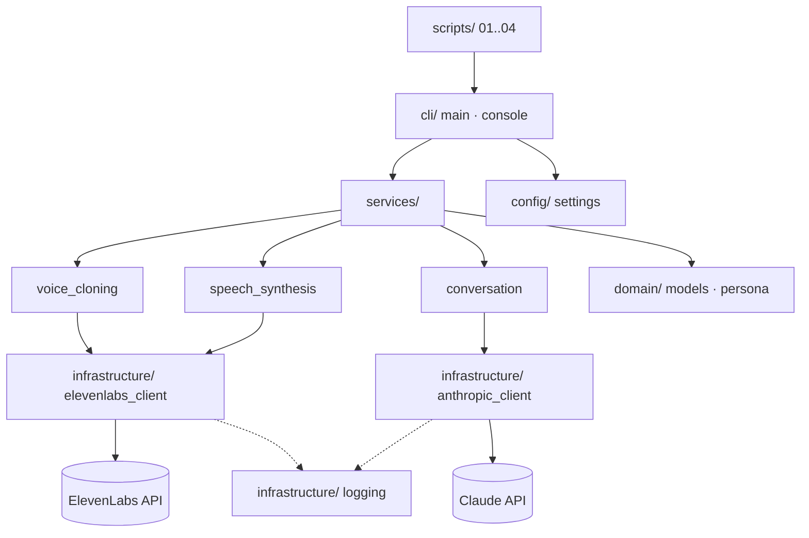
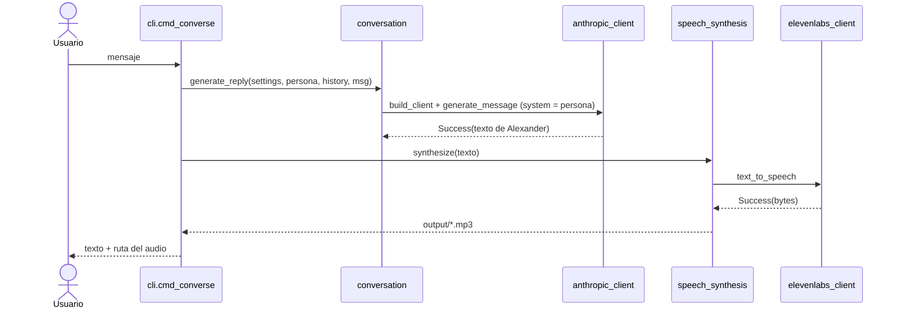

# Diagramas — VoiceClone

## Capas y dependencias

```mermaid
flowchart TD
    S[scripts/ 01..04] --> CLI[cli/ main · console]
    CLI --> SV[services/]
    SV --> VC[voice_cloning]
    SV --> SS[speech_synthesis]
    SV --> CO[conversation]
    VC --> ELC[infrastructure/ elevenlabs_client]
    SS --> ELC
    CO --> ANC[infrastructure/ anthropic_client]
    ELC --> EXT1[(ElevenLabs API)]
    ANC --> EXT2[(Claude API)]
    SV --> DOM[domain/ models · persona]
    CLI --> CFG[config/ settings]
    ELC -.-> LOG[infrastructure/ logging]
    ANC -.-> LOG
```

## Flujo de conversación (persona + voz)

```mermaid
sequenceDiagram
    actor U as Usuario
    participant C as cli.cmd_converse
    participant CV as conversation
    participant AC as anthropic_client
    participant SS as speech_synthesis
    participant EL as elevenlabs_client
    U->>C: mensaje
    C->>CV: generate_reply(settings, persona, history, msg)
    CV->>AC: build_client + generate_message (system = persona)
    AC-->>CV: Success(texto de Alexander)
    C->>SS: synthesize(texto)
    SS->>EL: text_to_speech
    EL-->>SS: Success(bytes)
    SS-->>C: output/*.mp3
    C-->>U: texto + ruta del audio
```
